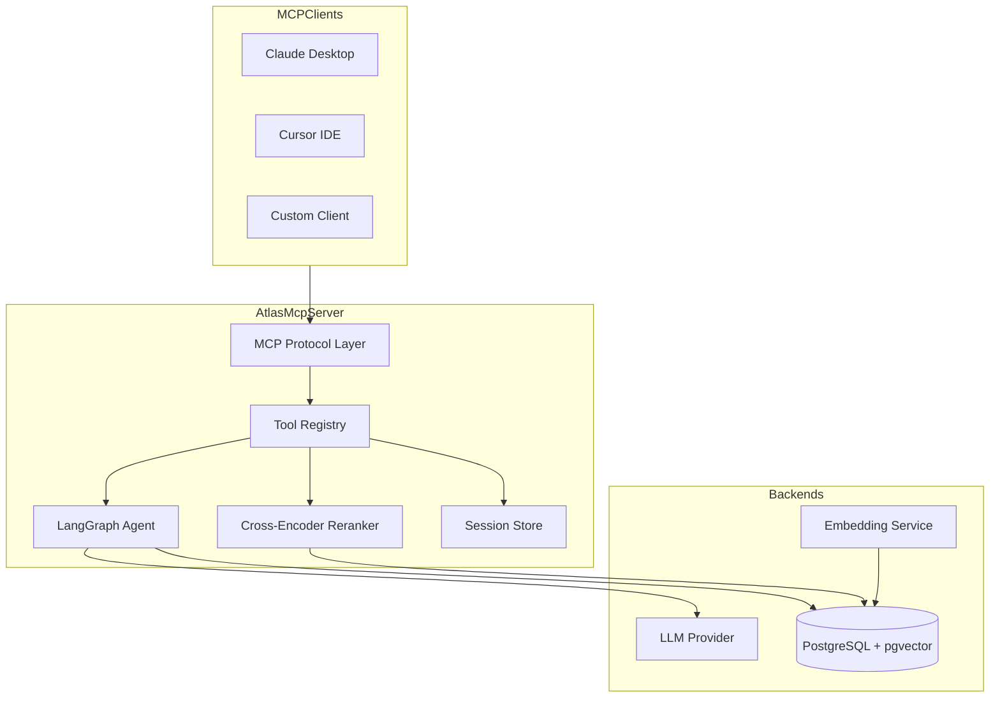

# atlas_mcp

An MCP server that brings AI-powered search and conversation to your FHIR clinical documents.


## What It Does

`atlas_mcp` is a developer-focused MCP server for working with FHIR data. It lets you embed FHIR resources, search them with semantic retrieval, and talk to an AI agent that can answer questions with citations from your clinical documents.

- AI agent that understands and queries FHIR documents
- Semantic search with cross-encoder reranking for accuracy
- Multi-turn conversations with session memory
- Local-first LLM support (Ollama), plus cloud options (OpenAI, Anthropic, Bedrock)

## Key Features

- Native FHIR resource handling and metadata extraction
- Vector embeddings plus access to full documents
- Built-in validation and HIPAA-aware prompts
- YAML + environment configuration for easy setup

## Quick Start (5 Minutes)

### 1) Clone and Install

```bash
git clone https://github.com/rsanandres/atlas_mcp.git
cd atlas_mcp
python -m venv venv
source venv/bin/activate  # On Windows: venv\Scripts\activate
pip install -r requirements.txt
```

### 2) Set Up PostgreSQL + pgvector

```bash
createdb hc_ai
psql -U postgres -d hc_ai -f scripts/setup_db.sql
```

### 3) Configure Environment

```bash
cp env.example .env
# Edit .env and set DB_PASSWORD at minimum
```

### 4) Start Ollama (Local-First)

```bash
ollama pull mxbai-embed-large:latest
ollama pull llama3
ollama serve
```

### 5) Run the Server

```bash
# stdio transport (Claude Desktop, Cursor)
python server.py

# HTTP transport
python server.py --transport streamable-http --port 8000
```

## Architecture



## Available Tools

**Agent tools**
- `agent_query`, `agent_clear_session`, `agent_health`

**Retrieval tools**
- `rerank`, `rerank_with_context`, `batch_rerank`

**Session tools**
- `session_append_turn`, `session_get`, `session_update_summary`, `session_clear`

**Embeddings tools**
- `ingest`, `embeddings_health`, `db_stats`, `db_queue`, `db_errors`

## Example Use Cases

- Querying patient records: “What medications is patient P123 taking?”
- Lab results analysis: “Show abnormal lab values from the last 30 days.”
- Clinical notes search: “Find notes mentioning diabetes management.”
- Medication history: “Has this patient been prescribed blood thinners?”

## Configuration

### Tool Configuration

Enable/disable tools in `config.yaml`:

```yaml
tools:
  agent_query:
    enabled: true
  rerank:
    enabled: true
  ingest:
    enabled: false
```

### LLM Providers (Local-First)

- **Ollama**: `LLM_PROVIDER=ollama`, `LLM_MODEL=llama3`
- **OpenAI**: `LLM_PROVIDER=openai`, `OPENAI_API_KEY`, `OPENAI_MODEL=gpt-4o-mini`
- **Anthropic**: `LLM_PROVIDER=anthropic`, `ANTHROPIC_API_KEY`, `ANTHROPIC_MODEL=claude-3-5-sonnet-20241022`
- **Bedrock**: `LLM_PROVIDER=bedrock`, `AWS_REGION`, `LLM_MODEL=haiku|sonnet|opus`

### Environment Variables

See `env.example` for all options. Core requirements:

| Variable | Description | Default |
|----------|-------------|---------|
| `DB_HOST` | PostgreSQL host | `localhost` |
| `DB_PORT` | PostgreSQL port | `5432` |
| `DB_NAME` | Database name | `hc_ai` |
| `DB_PASSWORD` | Database password | (required) |
| `EMBEDDING_PROVIDER` | `ollama` or `bedrock` | `ollama` |
| `LLM_PROVIDER` | `ollama`, `bedrock`, `openai`, `anthropic` | `ollama` |

### Debug Logging

```bash
HC_AI_DEBUG=true
```

### Timeouts

```bash
AGENT_TIMEOUT=60
RERANK_TIMEOUT=30
```

## Connecting to MCP Clients

### Claude Desktop

```json
{
  "mcpServers": {
    "atlas": {
      "command": "python",
      "args": ["/path/to/atlas_mcp/server.py"],
      "env": {}
    }
  }
}
```

### Cursor IDE

```json
{
  "atlas": {
    "command": "python",
    "args": ["/path/to/atlas_mcp/server.py"]
  }
}
```

## Example Usage

```python
result = await client.call_tool("agent_query", {
    "query": "What medications is patient P123 currently taking?",
    "session_id": "session-001",
    "patient_id": "P123"
})
```

## Requirements

- Python 3.11+
- PostgreSQL 14+ with pgvector
- Ollama (or cloud LLM credentials)

## Disclaimer

This project is **HIPAA-aware**, but it is **not HIPAA-certified**. It is intended for **development and testing only**. You are responsible for compliance and security if you use it in production.

## Author

Created by [@rsanandres](https://github.com/rsanandres). Issues and feedback welcome. Pull requests are reviewed.

## License

MIT License. See `LICENSE`.
